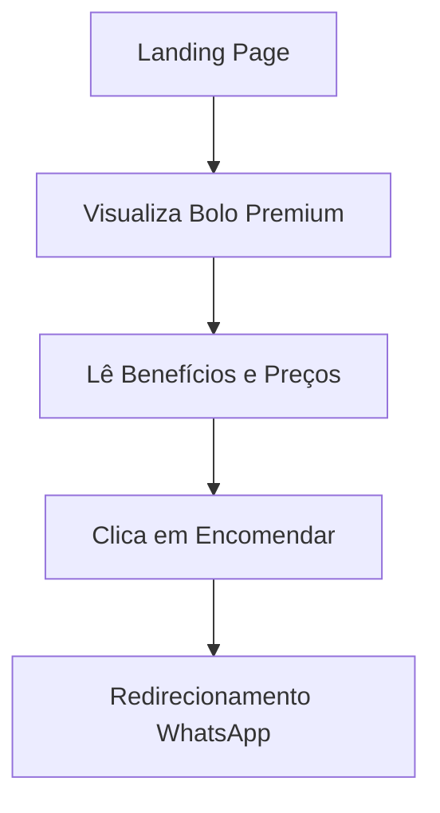

## 1. Product Overview
Landing page promocional para confeitaria especializada em bolos premium. A página apresenta um bolo de festa branco com morangos e trufas de chocolate branco como destaque principal, seguindo um design moderno e conversivo inspirado em layouts de streaming.

O produto visa aumentar as vendas de bolos personalizados, oferecendo qualidade premium e entrega imediata para eventos especiais.

## 2. Core Features

### 2.1 User Roles
Este produto não requer distinção de usuários - é uma landing page pública para conversão de vendas.

### 2.2 Feature Module
Nossa landing page de bolos consiste nos seguintes elementos principais:
1. **Página Inicial**: hero section com bolo destaque, card de preços, beneficios laterais, navegação superior.

### 2.3 Page Details
| Page Name | Module Name | Feature description |
|-----------|-------------|---------------------|
| Página Inicial | Header Navigation | Exibir logo "BELLE CAKE", links de navegação (Início, Sabores, Benefícios, Depoimentos), botão "Encomendar Agora" |
| Página Inicial | Hero Section | Apresentar bolo premium com morangos, badge "Promoção", headline "Bolos Artesanais", subheadline "Qualidade Premium | Entrega Imediata", card de preços com valor original riscado e preço promocional |
| Página Inicial | Benefits Cards | Exibir cards laterais com ícones: "Entrega Rápida", "Seguro", "5.0 Avaliações", "+500 Clientes Satisfeitos" |
| Página Inicial | CTA Section | Botão principal "Encomendar Agora" amarelo com ícone de check |

## 3. Core Process
O usuário acessa a landing page, visualiza o bolo premium em destaque, lê os benefícios e preços promocionais, e clica no botão de encomenda para iniciar o processo de compra.

## 4. User Interface Design

### 4.1 Design Style
- Cores Primárias: Amarelo (#FFD700) para CTAs, Branco (#FFFFFF) para texto principal
- Cores Secundárias: Preto/Dark (#1a1a1a) para fundo, Verde (#4CAF50) para economia
- Estilo de Botões: Arredondados com gradiente, sombra sutil
- Fonte: Sans-serif moderna, tamanhos variados (14px para body, 32px para headlines)
- Layout: Hero centralizado com cards de benefícios laterais, navegação fixa no topo
- Ícones: Estilo flat com cores sólidas e amarelo para destaque

### 4.2 Page Design Overview
| Page Name | Module Name | UI Elements |
|-----------|-------------|-------------|
| Página Inicial | Header | Background escuro translúcido, logo BELLE CAKE em amarelo com badge vermelho, navegação branca, botão CTA gradiente vermelho/laranja |
| Página Inicial | Hero Section | Background com imagem do bolo branco com morangos, badge promoção amarelo, headline branca/amarela, card de preços escuro semi-transparente |
| Página Inicial | Benefits Cards | Cards empilhados lado direito, background escuro semi-transparente, ícones amarelos, texto branco/amarelo |

### 4.3 Responsiveness
Desktop-first com adaptação mobile. O layout mantém a estrutura em telas maiores e reorganiza os elementos em coluna única para dispositivos móveis, com menu hambúrguer para navegação.