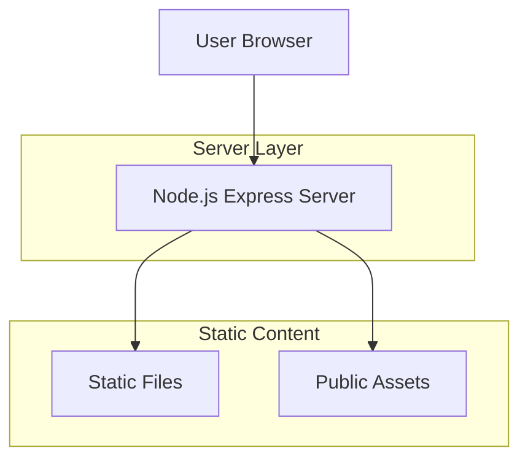
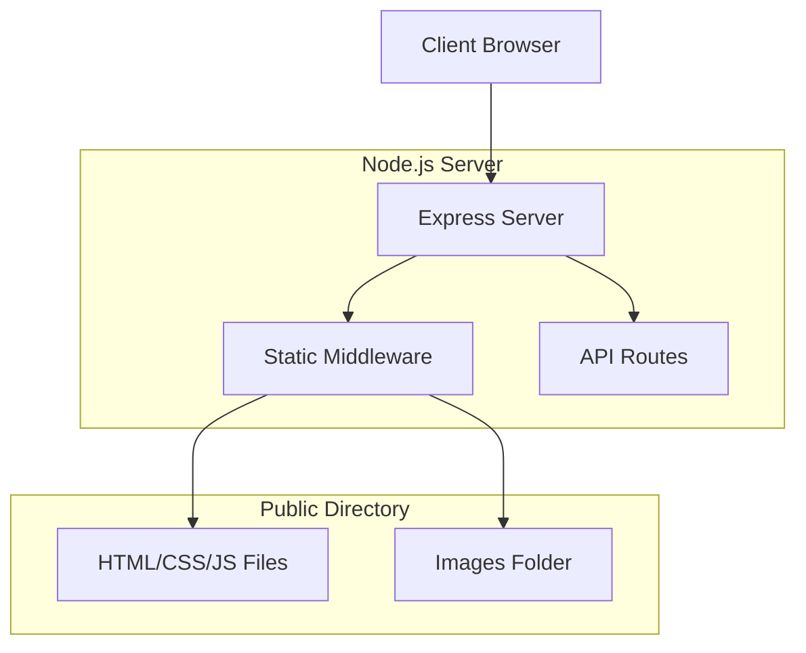

## 1. Architecture design



## 2. Technology Description
- Frontend: HTML5 + CSS3 + JavaScript Vanilla
- Backend: Node.js@18 + Express@4
- Initialization Tool: npm init
- Template Engine: EJS (opcional para renderização dinâmica)

## 3. Route definitions
| Route | Purpose |
|-------|---------|
| / | Landing page principal com hero section e formulário de contato |
| /api/contact | Endpoint para receber dados de contato via WhatsApp |

## 4. API definitions

### 4.1 Contact API
```
POST /api/contact
```

Request:
| Param Name| Param Type  | isRequired  | Description |
|-----------|-------------|-------------|-------------|
| name      | string      | true        | Nome do cliente |
| phone     | string      | true        | Telefone para WhatsApp |
| message   | string      | false       | Mensagem opcional |

Response:
| Param Name| Param Type  | Description |
|-----------|-------------|-------------|
| success   | boolean     | Status do envio |
| whatsappLink | string   | Link gerado para WhatsApp |

Example
```json
{
  "name": "Maria Silva",
  "phone": "11999999999",
  "message": "Quero encomendar um bolo de chocolate"
}
```

## 5. Server architecture diagram



## 6. Project Structure

```
bellecake/
├── public/
│   ├── css/
│   │   └── styles.css
│   ├── images/
│   │   └── bolo-premium.jpg
│   └── js/
│       └── main.js
├── views/
│   └── index.html
├── server.js
└── package.json
```

### 6.1 Dependencies
```json
{
  "name": "bellecake-landing",
  "version": "1.0.0",
  "description": "Landing page para confeitaria",
  "main": "server.js",
  "scripts": {
    "start": "node server.js",
    "dev": "nodemon server.js"
  },
  "dependencies": {
    "express": "^4.18.2"
  },
  "devDependencies": {
    "nodemon": "^3.0.1"
  }
}
```

### 6.2 Server Configuration
```javascript
// server.js
const express = require('express');
const path = require('path');
const app = express();
const PORT = process.env.PORT || 3000;

// Middleware para arquivos estáticos
app.use(express.static('public'));
app.use(express.json());

// Rota principal
app.get('/', (req, res) => {
  res.sendFile(path.join(__dirname, 'views', 'index.html'));
});

// API de contato
app.post('/api/contact', (req, res) => {
  const { name, phone, message } = req.body;
  const whatsappLink = `https://wa.me/55${phone}?text=Olá, meu nome é ${name}. ${message || 'Gostaria de encomendar um bolo.'}`;
  
  res.json({
    success: true,
    whatsappLink: whatsappLink
  });
});

app.listen(PORT, () => {
  console.log(`Server running on port ${PORT}`);
});
```